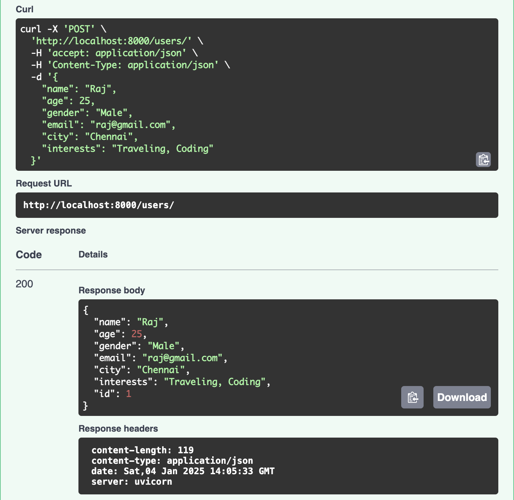
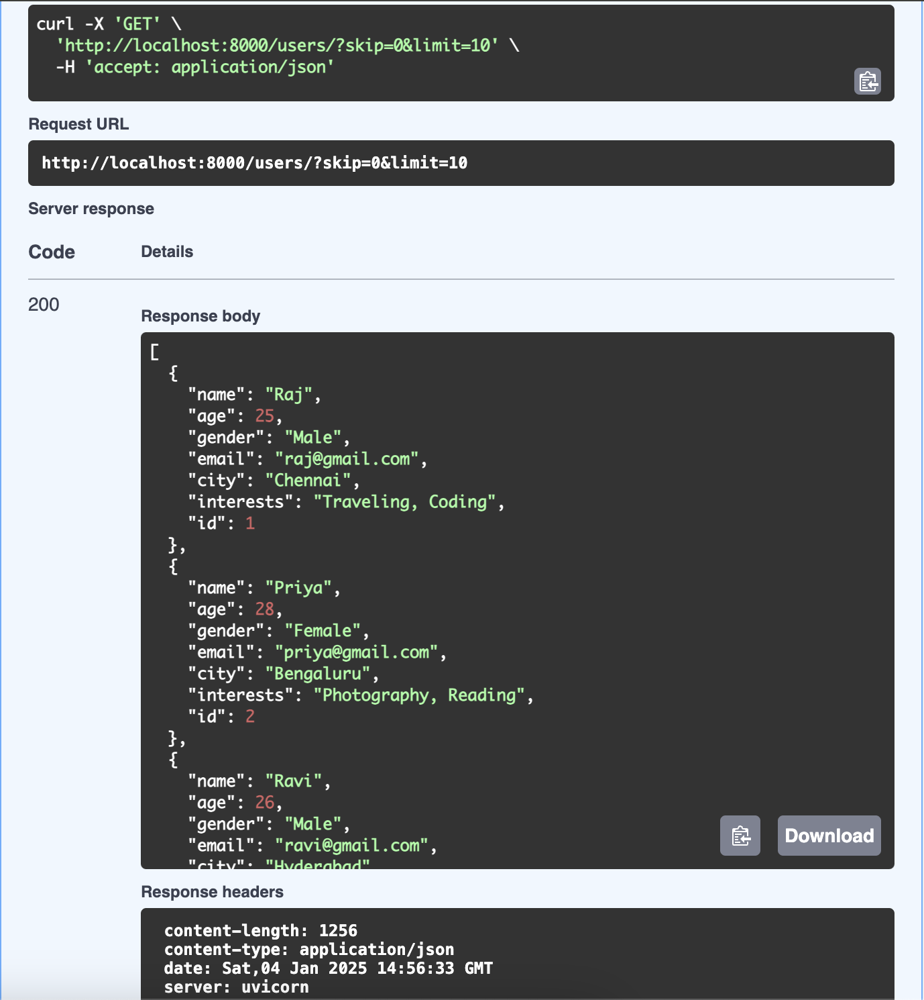
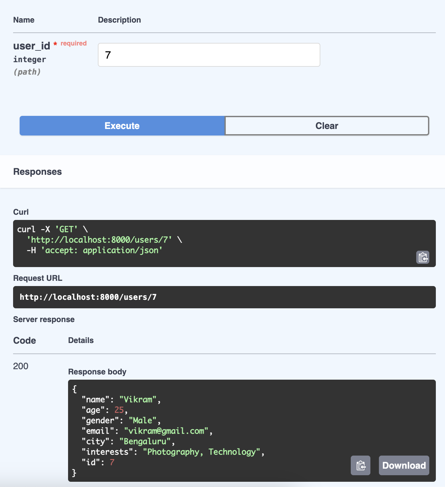
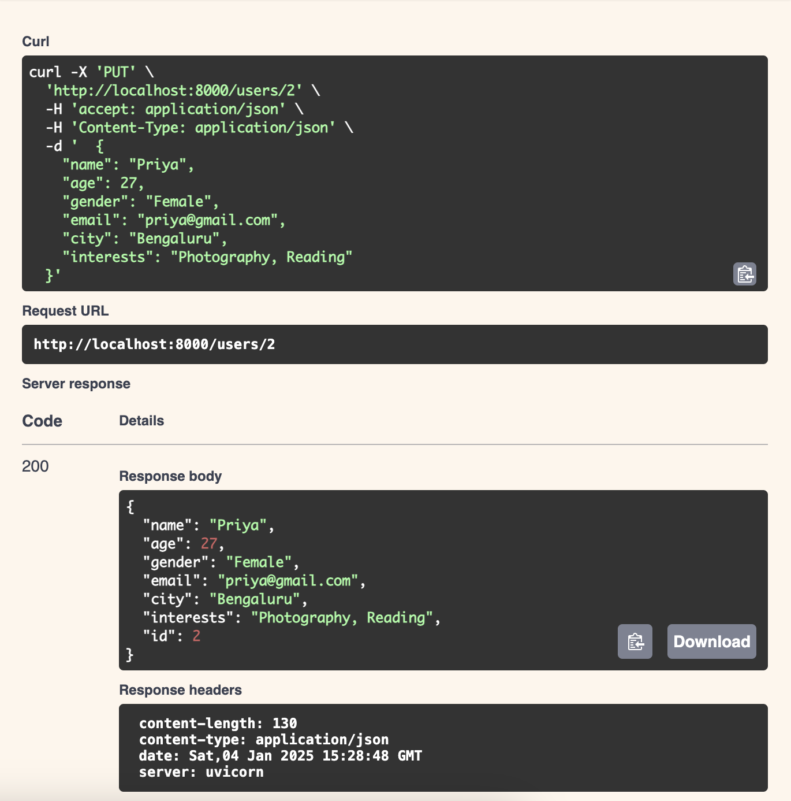
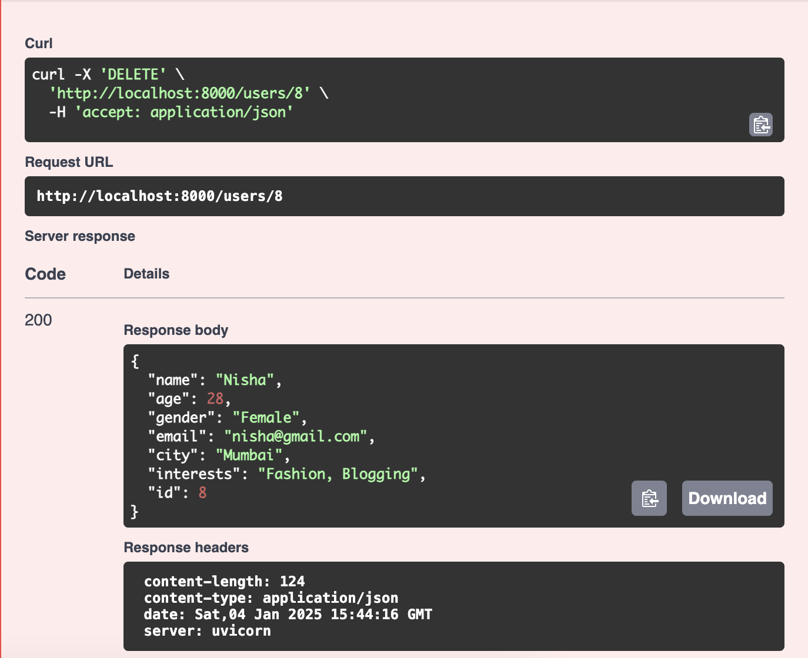
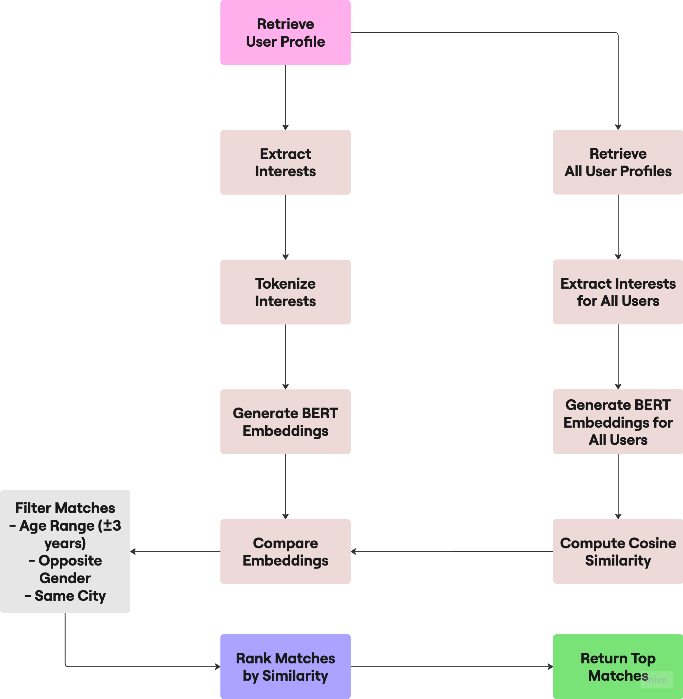
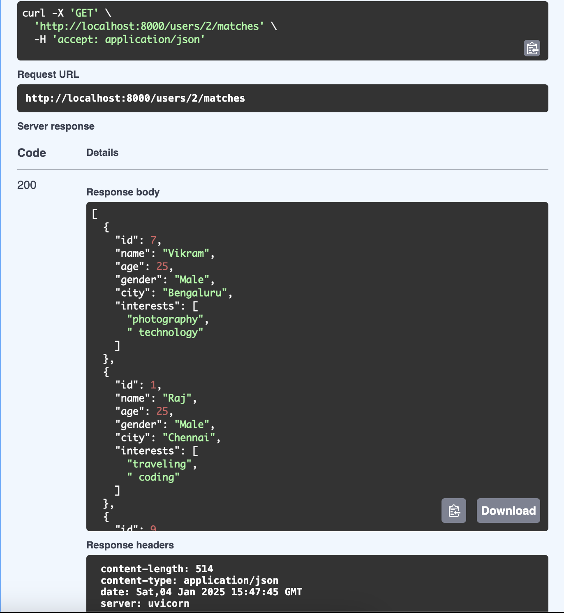
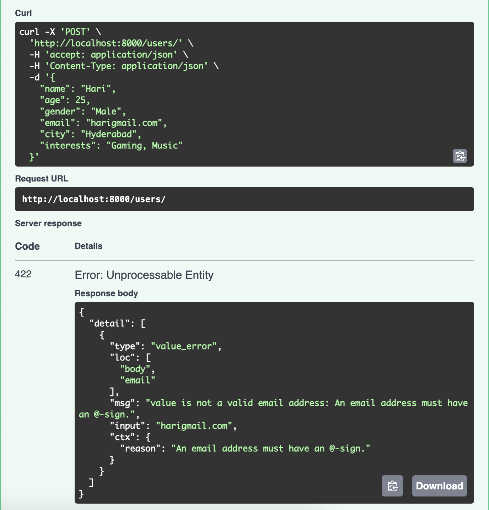
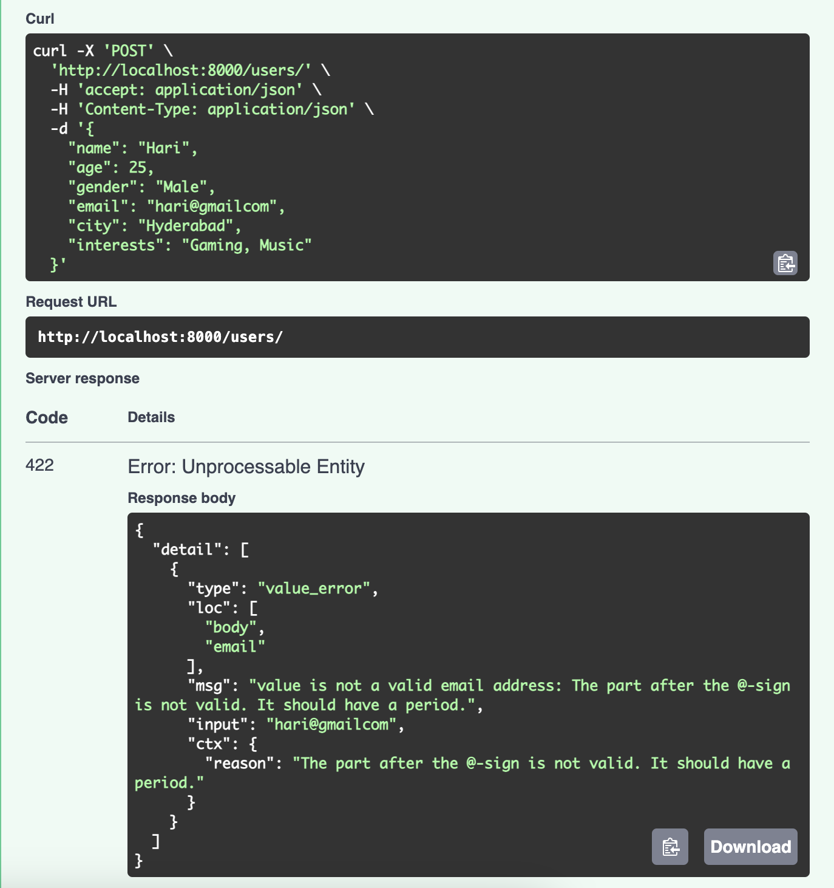
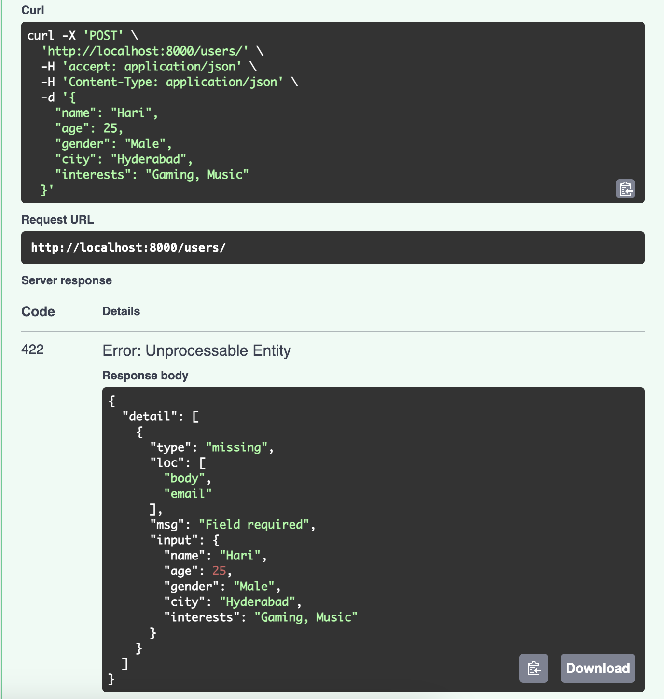

# Marriage Matchmaking App

## Description
The Marriage Matchmaking App is a FastAPI-based backend application designed to help users find potential matches based on their profiles. It supports CRUD operations, matchmaking using NLP-based similarity, and email validation.

---

## Features
1. **Create User Profiles**: Add user profiles with details such as name, age, gender, email, city, and interests.
2. **Read User Profiles**: Retrieve single or multiple user profiles.
3. **Update User Profiles**: Update user details by their ID.
4. **Delete User Profiles**: Delete user profiles by their ID.
5. **Find Matches**: Suggest matches based on:
   - Interest similarity using **BERT embeddings** and cosine similarity.
   - Age similarity (±3 years).
   - Opposite gender.
   - Same city.
6. **Email Validation**: Ensures valid email addresses for user profiles.

---

## Setup and Installation

### Prerequisites
- Python 3.7+
- SQLite
- Pip (Python Package Installer)

### Steps to Run the Application

1. **Clone the Repository**

   ```bash
   git clone https://github.com/abhishek-UM/UrbanMatch-PythonTask.git
   cd UrbanMatch-PythonTask
   ```

2. **Create a Virtual Environment and Activate It**

 ```bash
python -m venv venv
source venv/bin/activate  # On Windows: venv\Scripts\activate
```

3. **Install Dependencies**

 ```bash
pip install -r requirements.txt
pip install transformers torch
```

4. **Run the Application**

 ```bash
uvicorn main:app --reload
 ```

5. **Access the API Documentation Open your browser and navigate to:**

 ```bash
 http://127.0.0.1:8000/docs
  ```

6. **Database Setup: The SQLite database is automatically created when the app runs for the first time.**

---

## Implemented Features
---

## 1. User Management
### Create User
- **Endpoint**: `/users/` (POST)
- **Description**: Allows the creation of a new user profile.
- **Input**: User details such as name, age, gender, email, city, and interests.
- **Validation**:
  - Email format is validated.
  - Required fields are checked.
- **Response**: Returns the created user profile.


### Read All Users
- **Endpoint**: `/users/` (GET)
- **Description**: Fetches a list of all user profiles.
- **Parameters**:
  - `skip` (int): Number of records to skip (default: 0).
  - `limit` (int): Maximum number of records to retrieve (default: 10).
- **Response**: A list of user profiles.


### Get User by ID
- **Endpoint**: `/users/{user_id}` (GET)
- **Description**: Fetches a specific user profile by ID.
- **Parameters**:
  - `user_id` (int): The ID of the user.
- **Response**: The requested user profile.


### Update User
- **Endpoint**: `/users/{user_id}` (PUT)
- **Description**: Updates an existing user profile by ID.
- **Input**: Fields to update such as email, city, or interests.
- **Validation**:
  - Validates the email format if updated.
- **Response**: The updated user profile.


### Delete User
- **Endpoint**: `/users/{user_id}` (DELETE)
- **Description**: Deletes a user profile by ID.
- **Parameters**:
  - `user_id` (int): The ID of the user to delete.
- **Response**: The deleted user profile.


---

## 2. Matchmaking Features
### Find Matches Using NLP



- **Endpoint**: `/users/{user_id}/matches` (GET)

- **Description**: Finds potential matches for a given user using NLP-based interest similarity.

- **Criteria**:
  - Age range: ±3 years of the target user's age.
  - Gender: Matches the opposite gender.
  - Location: Matches users from the same city.
  - Interest similarity: Calculated using BERT embeddings and cosine similarity.

- **Composite Score Calculation**:
- Calculates a score for potential matches based on:
  - Interest similarity (NLP-based).
  - City match.
  - Age difference.

- **Algorithm**:
  1. Extracts and tokenizes interests.
  2. Generates BERT embeddings for user interests.
  3. Computes cosine similarity between embeddings.
  4. Filters and ranks matches based on composite scores:
     - 60% weight: Interest similarity.
     - 30% weight: Location match.
     - 10% weight: Age difference.
- **Response**: Top 5 matches sorted by similarity score.


---

## 3. Email Validation

- Ensures that the `email` field in user profiles contains valid email addresses.
- **Validation Method**:
  - Utilizes **Pydantic's `EmailStr` field type**, which automatically validates email formats.
  - Returns a 422 error for invalid email addresses during user creation or update.



---


# Future Work and Advanced Features  

As the Marriage Matchmaking App evolves, there are several opportunities for enhancement and expansion to make the application more robust, scalable, and feature-rich.  

---

## 1. Advanced NLP Techniques  
### Semantic Analysis with Advanced Models  
- **Transformer Models**: Utilize state-of-the-art transformer models such as GPT or fine-tuned BERT models for even more accurate interest matching.  
- **Sentiment Analysis**: Analyze user interests' sentiment to infer compatibility beyond simple similarity.  

### Contextual Matching  
- Introduce contextual NLP methods to understand user preferences more deeply, including nuanced interests or descriptions.  

---

## 2. Geographical Features  
### Latitude and Longitude Matching  
- Replace the current city-based filtering with precise geographical distance matching using latitude and longitude data.  
- Implement the **Haversine formula** to calculate distances and provide users with proximity-based matches.  

### Travel Willingness  
- Allow users to specify their willingness to travel and adjust match rankings based on proximity.  

---

## 3. Improved Database Design  
### Migration to a More Robust Database  
- Move from **SQLite** to a more scalable solution like **PostgreSQL** or **MongoDB** for production environments.  
- Implement advanced indexing (e.g., geospatial indexing for location-based matching).  

### User Activity Tracking  
- Add a new database table to log user activities (e.g., profile updates, match interactions, etc.) for analytics and insights.  

---

## 4. Enhanced Matchmaking Criteria  
### Compatibility Scores  
- Introduce a scoring system for more comprehensive compatibility calculations, including:  
  - **Personality types**.  
  - **Hobbies** and shared experiences.  
  - **Cultural preferences** (e.g., language, religion).  

### Machine Learning-Based Recommendation Engine  
- Train a recommendation model using user interaction data to improve match accuracy over time.  

---

## 5. Gamification  
- Introduce gamified elements such as:  
  - Compatibility quizzes.  
  - Points for completing profiles or interacting with matches.  

---

These enhancements aim to make the Marriage Matchmaking App more comprehensive, engaging, and scalable while offering users a seamless experience.  
